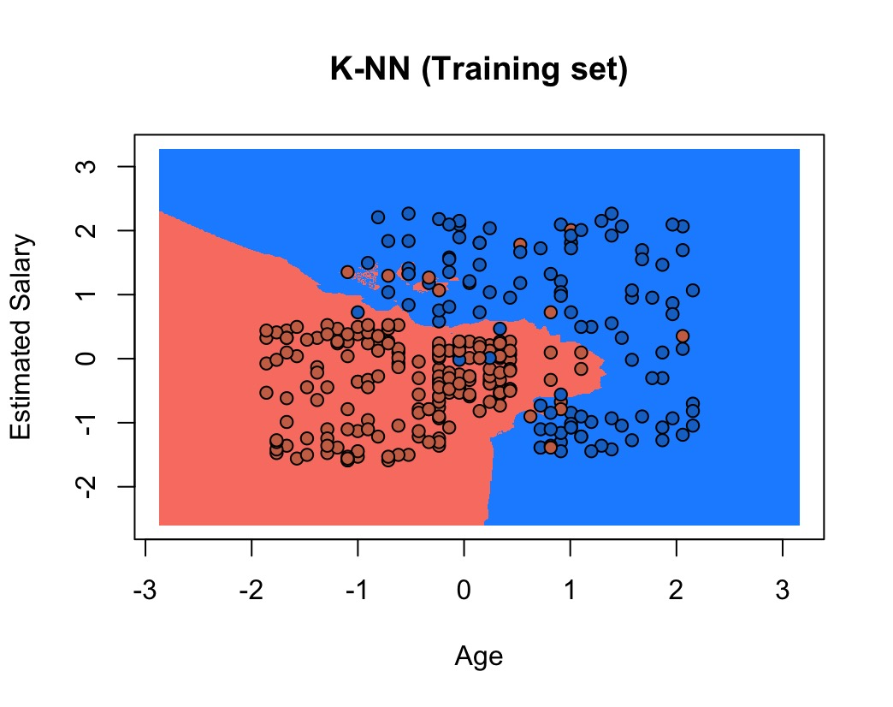
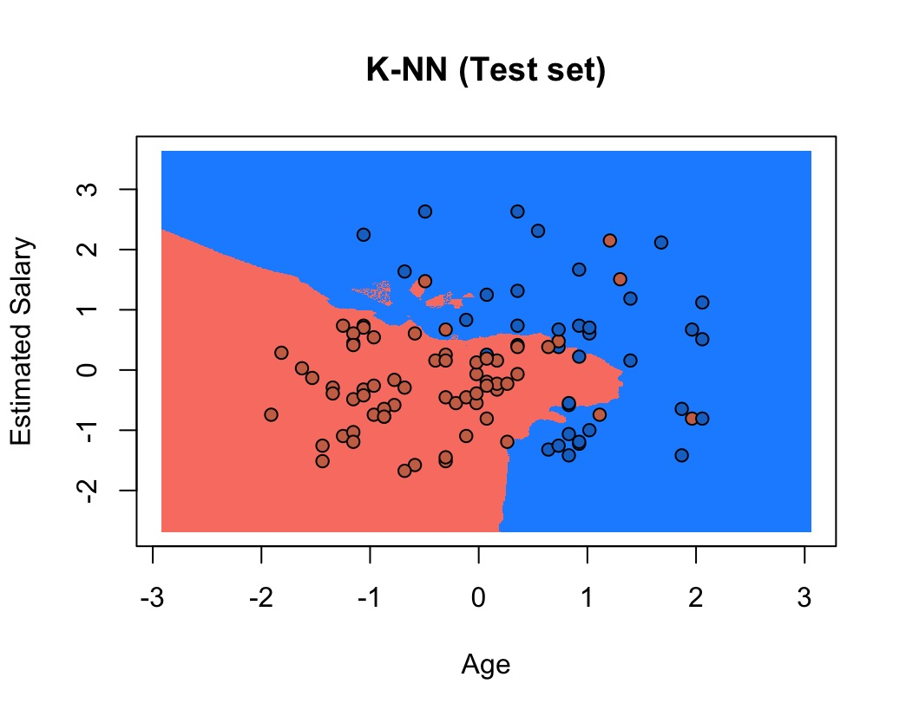

# K-Nearest Neighbors Classification | R

A KNN classification model that predicts whether a user will purchase 
a product based on Age and Estimated Salary.

## Dataset
Social Network Ads (400 entries) — features: Age, Estimated Salary, Purchased

## Tech Stack
- **Language:** R
- **Libraries:** class, caTools, ElemStatLearn

## Implementation
- 75/25 train-test split with feature scaling
- KNN model with k = 5
- Confusion matrix for accuracy evaluation
- Decision boundary visualized for training and test sets

## Results



## How to Run
```r
install.packages(c('caTools', 'class', 'ElemStatLearn'))
# Then run knn_model.R in RStudio
```

## Author
**Ayush Kanyal** — [GitHub](https://github.com/AyushKanyal-me)
